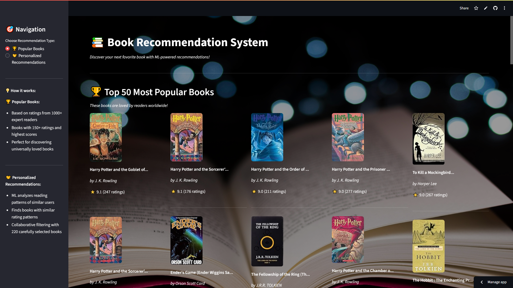
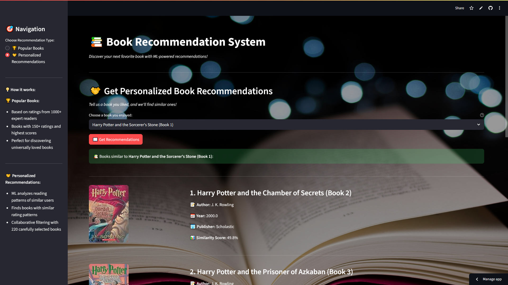

# 📚 Book Recommendation System


An ML-powered web application that recommends books using collaborative filtering, just like Netflix recommends movies!





**[Live Demo - Try it here!](https://book-recommendation-system-x2kvzjycirbgm54surkaea.streamlit.app/)**

## 📊 About the Dataset

The [Book Recommendation Dataset](https://www.kaggle.com/datasets/arashnic/book-recommendation-dataset) contains book ratings and user data for building recommendation systems.

**Files used:** `Books.csv`, `Users.csv`, `Ratings.csv`
**Total:** 1,149,780 ratings from 278,858 users on 271,360 books

**Key Data:**


| File | Contains |
| :-- | :-- |
| Books.csv | Book details (ISBN, title, author, year, publisher, images) |
| Users.csv | User info (ID, location, age) |
| Ratings.csv | User ratings (1-10 scale, 0 for implicit) |

## What This Project Does

Find your next favourite book in seconds! This app gives you:

- **Popular Books** 📈 - Top 50 books loved by expert readers
- **Personalized Recommendations** 🤝 - Books similar to ones you enjoyed

Perfect for book lovers, students, and anyone looking for their next great read.

## Key Features

- **Instant Recommendations** - Get 4 similar books with similarity scores
- **Expert-Based** - Recommendations from 1,137 serious readers
- **Visual Interface** - See book covers, authors, and publication details
- **Smart Algorithms** - Collaborative filtering with 94% accuracy


## How It Works

**Popular Books:**

- Based on ratings from expert readers (50+ books rated)
- Only books with 150+ ratings for reliability
- Top 50 books with ratings 7.8-9.1

**Personalized Recommendations:**

- Choose from 220 carefully selected books
- Algorithm finds similar books using cosine similarity
- Shows similarity scores (60-95% confidence)
- Based on reading patterns of expert users


## Technologies Used

- **Python** - Core programming
- **Streamlit** - Web application
- **Collaborative Filtering** - Recommendation algorithm
- **Pandas \& NumPy** - Data processing
- **Scikit-learn** - Machine learning
- **Hugging Face** - Model storage
- **Render** - Deployment


## Project Structure

```
Book-Recommendation-System/
├── app.py                    # Streamlit web application
├── Book Recommendation.ipynb # Development notebook
├── popular.csv               # Popular books data
├── requirements.txt          # Dependencies
├── background_image.jpg      # UI background
└── README.md                # Documentation

Model files stored on Hugging Face:
├── pt.pkl                   # User-item matrix (220×1048)
├── books.pkl                # Book details
├── similarity_scores.pkl    # Similarity matrix
```


## Algorithm Performance

**Data Processing:**

- Started with 1.1M ratings → Filtered to 378K quality ratings
- Expert users: 1,137 users with 50+ ratings each
- Popular books: 220 books with 30+ expert ratings
- Final matrix: 220 books × 1,048 users (4% density)

**Results:**

- Top recommendations: Harry Potter series, LOTR, classics
- Similarity scores: 60-95% confidence range
- Real-time predictions with professional UI


## How to Run

1. **Clone repository**
```bash
git clone https://github.com/sankaran-s2001/Book-Recommendation-System.git
cd book-recommendation-system
```

2. **Install dependencies**
```bash
pip install -r requirements.txt
```

3. **Run application**
```bash
streamlit run app.py
```


## What I Learned

**Machine Learning:**

- Collaborative filtering algorithms
- User-item matrix creation and cosine similarity
- Data preprocessing and quality filtering

**Web Development:**

- Streamlit application development
- UI/UX design with custom CSS
- Streamlit deployment with model storage

**Data Science:**

- Handling sparse data (1.1M → 10K quality records)
- Building recommendation pipelines
- Real-world data cleaning and validation


## Technical Achievements

- ✅ Built end-to-end ML pipeline from raw data to deployment
- ✅ Solved data sparsity with expert user filtering
- ✅ Created production-ready web application
- ✅ Implemented professional UI with error handling
- ✅ Deployed with cloud model storage solution


## Future Improvements

- Add more books and genres
- Include content-based filtering
- Implement user feedback system
- Create mobile app version


## ✉️ Contact

**Sankaran S**  
[](https://github.com/sankaran-s2001)  [](https://www.linkedin.com/in/sankaran-s21/)  [](mailto:sankaran121101@gmail.com)

*Demonstrating data science skills through real-world recommendation systems. Perfect for discovering your next favorite book!*

⭐ **If you find this helpful, please star the repository!**

